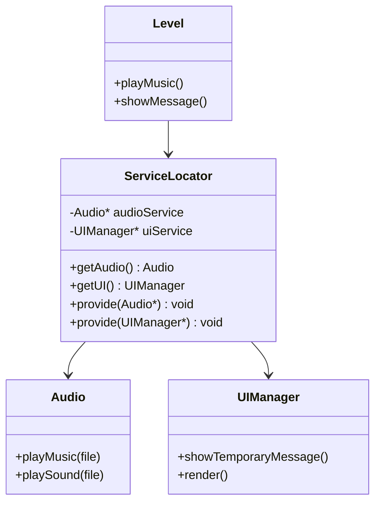
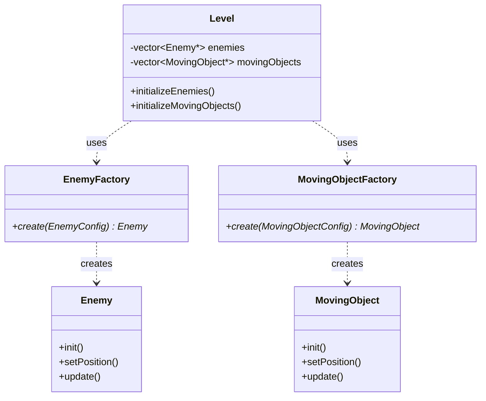
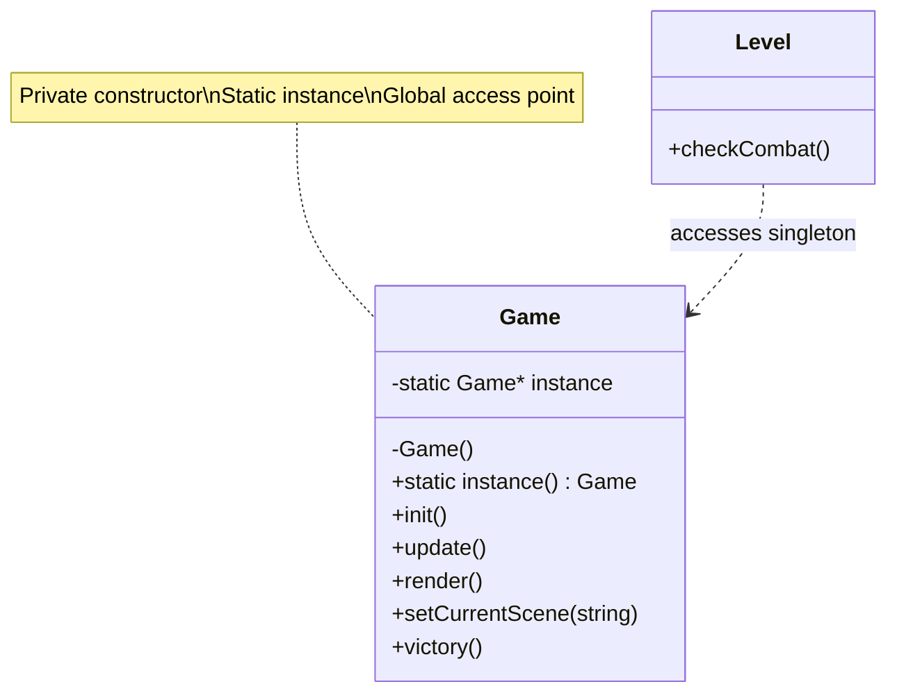
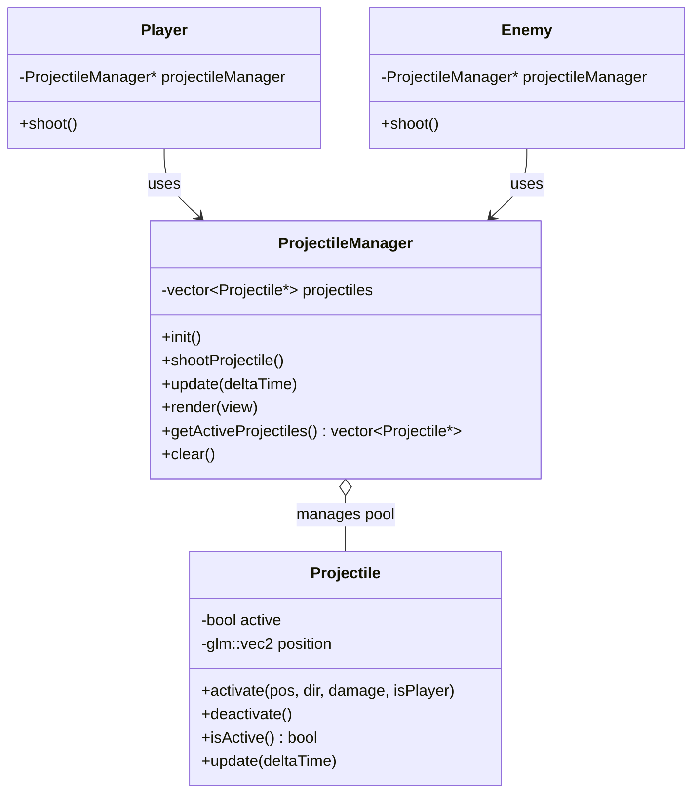

# Software Design Patterns - Ninja Gear

This document explains the software design patterns and architectural decisions used in the Ninja Gear game engine.

## Table of Contents

1. [Service Locator Pattern](#service-locator-pattern)
2. [Factory Pattern](#factory-pattern)
3. [Observer Pattern](#observer-pattern)
4. [Singleton Pattern](#singleton-pattern)
5. [Object Pool Pattern](#object-pool-pattern)
6. [Component Pattern](#component-pattern)

---

## Service Locator Pattern

**Used in:** `ServiceLocator` class for audio and UI management

### Purpose
Provides global access to services without tight coupling between classes.

### Class Diagram



### Implementation

```cpp
// ServiceLocator.h
class ServiceLocator {
private:
    static Audio* audioService;
    static UIManager* uiService;
    
public:
    static Audio& getAudio() { return *audioService; }
    static UIManager& getUI() { return *uiService; }
    
    static void provide(Audio* service) { audioService = service; }
    static void provide(UIManager* service) { uiService = service; }
};

// ServiceLocator.cpp
Audio* ServiceLocator::audioService = nullptr;
UIManager* ServiceLocator::uiService = nullptr;
```

### Usage Example

```cpp
// Level.cpp - Playing music
void Level::updateMusic() {
    auto it = sectorMusicMap.find({ currentSectorI, currentSectorJ });
    if (it != sectorMusicMap.end()) {
        const MusicConfig& config = it->second;
        if (config.musicFile != currentMusicFile) {
            currentMusicFile = config.musicFile;
            ServiceLocator::getAudio().playMusic(config.musicFile.c_str());
        }
    }
}

// Level.cpp - Showing UI message
void Level::itemPickUpEvent(int indexInVector) {
    Item* itemPicked = items[indexInVector];
    std::string pickupText = "PICKED UP " + itemPicked->getName() + "!";
    
    ServiceLocator::getUI().showTemporaryMessage(
        pickupText, 
        glm::vec2(320, 160), 
        1.0f, 
        glm::vec3(0.f, 0.f, 0.f), 
        2000
    );
}
```
---

## Factory Pattern

**Used in:** `EnemyFactory`, `MovingObjectFactory`

### Purpose
Centralizes object creation logic and provides a clean interface for creating different types of objects.

### Class Diagram



### Implementation

```cpp
// EnemyFactory.h
class EnemyFactory {
public:
    static Enemy* create(
        const EnemyConfig& config,
        const glm::ivec2& screenSize,
        ShaderProgram& program,
        TileMap* map,
        const vector<TileMap*>& allMaps,
        ProjectileManager* projectileManager
    );
};

// EnemyFactory.cpp
Enemy* EnemyFactory::create(
    const EnemyConfig& config,
    const glm::ivec2& screenSize,
    ShaderProgram& program,
    TileMap* map,
    const vector<TileMap*>& allMaps,
    ProjectileManager* projectileManager
) {
    Enemy* enemy = new Enemy();
    
    enemy->init(screenSize, program);
    enemy->setPosition(glm::vec2(
        config.x * map->getTileSize(),
        config.y * map->getTileSize()
    ));
    enemy->setTileMaps(allMaps);
    enemy->setProjectileManager(projectileManager);
    
    // Configure enemy based on config
    enemy->setHealth(config.health);
    enemy->setDamage(config.damage);
    enemy->setBoss(config.isBoss);
    
    return enemy;
}
```

### Usage Example

```cpp
// Level.cpp
void Level::initializeEnemies() {
    for (const auto& config : enemyConfigs) {
        Enemy* enemy = EnemyFactory::create(
            config,
            glm::ivec2(GameConfig::SCREEN_X, GameConfig::SCREEN_Y),
            texProgram,
            maps[0],
            maps,
            &projectileManager
        );
        if (enemy) {
            enemies.push_back(enemy);
        }
    }
}

void Level::initializeMovingObjects() {
    for (size_t i = 0; i < movingObjectConfigs.size(); i++) {
        const MovingObjectConfig& config = movingObjectConfigs[i];
        
        MovingObject* obj = MovingObjectFactory::create(
            config,
            &movingObjectTextures[i],
            &texProgram,
            maps,
            glm::ivec2(GameConfig::SCREEN_X, GameConfig::SCREEN_Y)
        );
        
        if (obj) {
            movingObjects.push_back(obj);
        }
    }
}
```

---
## Singleton Pattern

**Used in:** `Game` class, `GameConfig`

### Purpose
Ensures a class has only one instance and provides global access to it.

### Class Diagram



### Implementation

```cpp
// Game.h
class Game {
private:
    static Game* _instance;
    Game() {}  // Private constructor
    
public:
    static Game& instance() {
        if (_instance == nullptr) {
            _instance = new Game();
        }
        return *_instance;
    }
    
    void setCurrentScene(const string& sceneName);
    void victory();
};

// Game.cpp
Game* Game::_instance = nullptr;
```

### Usage Example

```cpp
// Level.cpp
void Level::handlePlayerAttack() {
    // ... combat logic ...
    
    if (!enemy->isAlive()) {
        if (enemy->isBoss()) {
            Game::instance().victory();  // Access singleton
        }
        delete enemy;
        player->increaseRank(1);
        it = enemies.erase(it);
        continue;
    }
}

void Level::checkTransitionTiles() {
    // ... tile checking ...
    
    for (const auto& transition : transitionTiles) {
        if (transition.tileId == tileId) {
            Game::instance().setCurrentScene(transition.targetScene);  // Access singleton
            player->setPosition(newPos);
            return;
        }
    }
}
```

### Benefits & Trade-offs

✅ **Benefits:**
- Guaranteed single instance
- Global access point
- Lazy initialization
- Controlled access to sole instance

⚠️ **Trade-offs:**
- Global state (harder to test)
- Can hide dependencies
- Not thread-safe (as implemented)
- Tight coupling to singleton

---

## Object Pool Pattern

**Used in:** `ProjectileManager` for projectile reuse

### Purpose
Reuses objects instead of creating/destroying them, improving performance.

### Class Diagram



### Implementation

```cpp
// ProjectileManager.h
class ProjectileManager {
private:
    vector<Projectile*> projectiles;  // Object pool
    
public:
    void shootProjectile(
        const glm::vec2& position,
        const glm::vec2& direction,
        int damage,
        bool isPlayerProjectile
    );
    
    void update(int deltaTime);
    vector<Projectile*> getActiveProjectiles() const;
};

// ProjectileManager.cpp
void ProjectileManager::shootProjectile(
    const glm::vec2& position,
    const glm::vec2& direction,
    int damage,
    bool isPlayerProjectile
) {
    // Try to find inactive projectile
    for (Projectile* p : projectiles) {
        if (!p->isActive()) {
            p->activate(position, direction, damage, isPlayerP